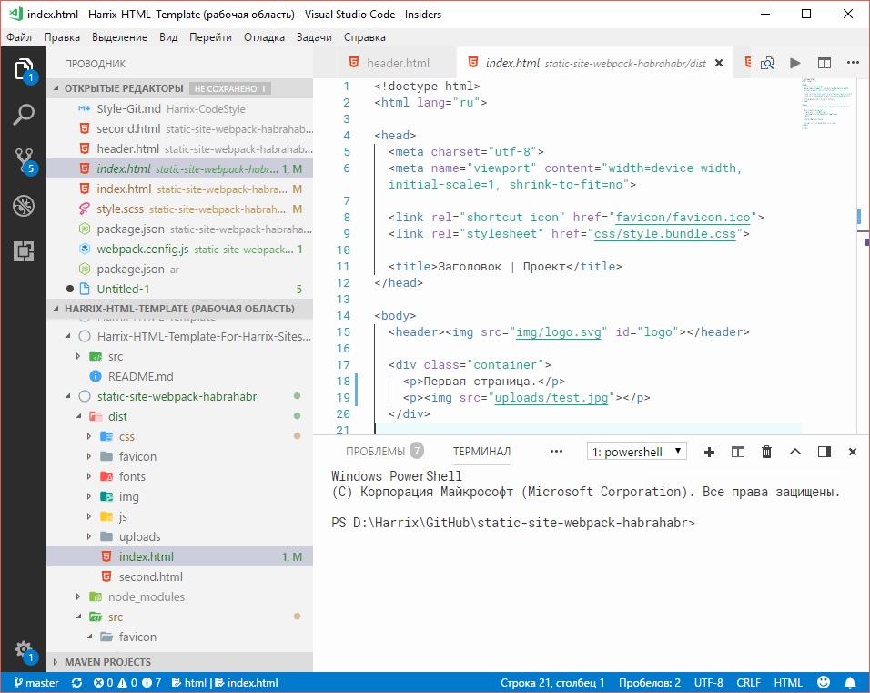

# Простой статический сайт на webpack 4

Данная статья является документацией к проекту [static-site-webpack-habr](https://github.com/Harrix/static-site-webpack-habr). С помощью пакета webpack под Node.js и других пакетов, включая HTML шаблонизатор, создается набор HTML страниц, которые удобно использовать для тестирования HTML шаблонов или для генерации простого статического сайта.

На Хабре находится устаревшая версия этой [статьи](https://habr.com/ru/post/350886/). За это время некоторые подходы изменились, некоторые пакеты обновились, а некоторые пакеты устарели. Так что в этой статье представлен сильно переработанный вариант того материала.

## Постановка задачи

Сайт представляет собой простой набор HTML страниц со своими CSS стилями и файлом JavaScript. Необходимо написать проект, который бы собирал наш сайт из исходников:

- из SASS (точнее SCSS) файлов формируется один CSS файл;
- из различных JavaScript библиотек и пользовательского кода формируется один JavaScript файл;
- HTML страницы собираются с помощью шаблонов, где содержимое шапки и футера можно разнести по отдельным файлам.

В собранном сайте не должны использоваться [React](https://reactjs.org/), [Vue.js](https://vuejs.org/), [Angular](https://angularjs.org/) или другие подобные фреймворки. Причина не в том, что я не люблю эти фреймворки, а в том, что хочу  в тестовом примере использовать универсальный подход без привязки к какому-то конкретному JavaScript фреймворку.

При выборе технологий выбираются по возможности наиболее популярные на текущий момент. По этой причине отказался и от [Grunt](https://gruntjs.com/), и [Gulp](https://gulpjs.com/) в пользу [webpack](https://webpack.js.org/), хотя, если честно, синтаксис Gulp мне понравился больше своим однообразием при составлении скриптов.

Для примера будет сверстано несколько страничек на базе CSS фреймворка [Bootstrap 4](https://getbootstrap.com/). Но это только для примера, и вы можете спокойно использовать любой другой CSS движок или не использовать вообще никакой.

Предполагается, что [Node.js](https://nodejs.org/) у вас уже установлен  (в Windows просто нужно скачать файл-установщик и установить в стиле «далее, далее»), и вы умеете работать с командной строкой [CLI](https://ru.wikipedia.org/wiki/Интерфейс_командной_строки) (в Windows это `cmd` или `PowerShell`).

Нужно получить в итоге набор готовых HTML страниц, которые можно залить на любой хостинг без дополнительных действий (например, на [GitHub Pages](https://pages.github.com/)) или открыть локально на компьютере без поднятия сервера.

## Структура проекта

Общая структура проекта представлена ниже:

```text
.
├── dist                 - папка, куда будет собираться итоговый сайт
├─┬ src                  - папка с исходниками сайта
│ ├── favicon            - папка с файлами иконок для сайта
│ ├── fonts              - папка со шрифтами
│ ├─┬ html               - папка шаблонов HTML страниц
│ │ ├── includes         - папка с встраиваемыми шаблонами (header, footer и др.)
│ │ └── views            - папка с самими HTML страницами
│ ├── img                - папка с общими изображениями (логотип, иконки и др.)
│ ├── js                 - папка с JavaScript файлами
│ ├── scss               - папка с SСSS файлами стилей
│ └── uploads            - папка с файлами статей (картинки, архивы и др.)
├── package-lock.json    - файл со списком версий пакетов (редактируется автоматически)
├── package.json         - файл настроек Node.js
└── webpack.config.js    - файл настроек webpack
```

Ниже приведена та же структура проекта, но с отображением файлов, которые присутствуют в примере из данной статьи:

```text
.
├── dist
├─┬ src
│ ├─┬ favicon
│ │ └── favicon.ico
│ ├─┬ fonts
│ │ └── Roboto-Regular.ttf
│ ├─┬ html
│ │ ├─┬ includes
│ │ │ ├── footer.html
│ │ │ └── header.html
│ │ └─┬ views
│ │   ├── index.html
│ │   └── second.html
│ ├─┬ img
│ │ └── logo.svg
│ ├─┬ js
│ │ └── index.js
│ ├─┬ scss
│ │ └── style.scss
│ └─┬ uploads
│   └── test.jpg
├── package-lock.json
├── package.json
└── webpack.config.js
```

Спорным решением может показаться разделение файлов изображений на две папки: `img` и `uploads`. Но здесь я использовал идеологию расположения файлов из [Wordpress](https://ru.wordpress.org/), так как на мой взгляд, размещать все изображения в одной папке — это не очень хороший подход.

В папке проекта [static-site-webpack-habr](https://github.com/Harrix/static-site-webpack-habr) находятся также дополнительные служебные файлы и папки (например, папка `docs` с документацией к проекту, файл `README.md` с описанием проекта и др.). Но эти все остальные файлы и папки несут лишь служебную функцию, так что можно копировать в свой проект только вышеприведенные.

При установке пакетов появится папка `node_modules` с устанавливаемыми пакетами на основании информации из файлов `package.json` и `package-lock.json` (второй файл вы сами не трогаете, так как он генерируется самим Node.js на основании первого файла `package.json`). Эту папку не надо заливать, например, на GitHub через коммиты. С ней вручную вообще лучше ничего не делать.

Для работы с проектом использую популярный текстовой редактор [Visual Studio Code](https://code.visualstudio.com/), которым очень доволен. Особенно нравится, что командная строка встроена в саму программу и вызывается через комбинацию клавиш `Ctrl` + `` ` ``.



Сделаем шаблон Node.js нашего проекта. Для этого создадим папки проекта с вышеописанной структурой (`dist`, `src` и так далее) и перейдем в неё в командной строке, где вызовем команду для создания файла `package.json`:

```console
npm init
```

На предложенные вопросы можно не отвечать, нажимая `Enter`, если не хочется заполнять подробную информацию о проекте (особенно в данном тестового проекта).

После всего этого установим три пакета общего назначения, которые нам потребуются в любом случае: `webpack`, `webpack-cli` (работу с командной строкой в webpack вынесли в отдельный пакет) и `webpack-dev-server` (для запуска локального сервера на вашем компьютере, чтобы изменения в проекте сразу отображались в браузере):

```console
npm install webpack webpack-cli webpack-dev-server --save-dev
```

Файл `package.json` в текущий момент у вас выглядит примерно так (версии пакетов у вас скорее всего будут другими, так как они постоянно обновляться):

```json
{
  "name": "static-site-webpack-habr",
  "version": "1.0.0",
  "description": "",
  "main": "index.js",
  "scripts": {
    "test": "echo \"Error: no test specified\" && exit 1"
  },
  "license": "ISC",
  "devDependencies": {
    "webpack": "^4.42.0",
    "webpack-cli": "^3.3.11",
    "webpack-dev-server": "^3.10.3"
  }
}
```

## Собираем JavaScript
